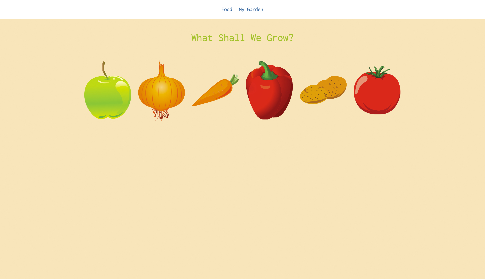

Lets grow
=====================

Lets grow is a React app that I have used primarily to get my head around React a little bit more. Lets grow uses Redux and Webpack and lists how to grow a selection of fruit and vegetables in the garden. It also gives you warnings when to water the growing plants. Please note the warnings are currently set at every 10 seconds but are configurable!

### How to run

1. `git clone` repo
2. `npm install` to get the node_modules
3. `npm start` to initialize the app
4. visit [http://localhost:8080/](http://localhost:8080/)

### Hierarchy

Quick breakdown of the main files and how `react-router` and `react-redux` live within it.

+ `index.html` - contains the html markup that the application will be contained within. In this case `<main id="lets-grow" />`
+ `index.js` - contains initialization of the react-router
  * `App.js` - wraps the application in a layer that contains the top level navigation and all state changes occur while wrapped in this layer using `{this.props.children}`
  * `MyGardenContainer.js` (my garden) - contains each food item that is currently being grown and uses [moment.js] (http://momentjs.com/) to record, format and display the length of how long that food item has been growing for
  * `FoodContainer.js` (food) - a container that lists all available foods and links to individual foods. As this contains children in the `react-router` tree, it contains the `{this.props.children}` with will look out for parameters on the url that matches the fruit that is in the store and link to the correct food item via the `FoodItemContainer.js`
  * `FoodItemContainer.js` (eg. food/carrots) - contains the store and checks the param that it is passed. It gets the correct food from the store and passes it to the `FoodItem.js` which renders the food item
  * `FoodItem.js` - a presentational component that takes parameters and displays the correct food item
+ `action-creators.js` - These functions create an object ready to be dispatched to the reducers
+ `currentMonth.js` - Function that returns the correct class regarding whether that food is in season or not. This is linked to the calendar visual on the foodItem page
+ `NotificationContainer.js` - This gives you notifications when to water your plants. Currently these notifications are sped up so the prompts happen much faster than once a day!

### Tips

To use the es6 object spread especially when returning the state, you need to include the following in your package.json file. Find out more - [babel object rest spread] (https://babeljs.io/docs/usage/babelrc/)

But first `npm install babel-plugin-transform-object-rest-spread`

then in the `package.json` add an entry for `babel`

  `"babel": {
    "plugins": [
      "transform-object-rest-spread"
    ]
  }`

### Future

Create a store using Firebase to which would then allow users to create an account, login and check their currently growing items.
